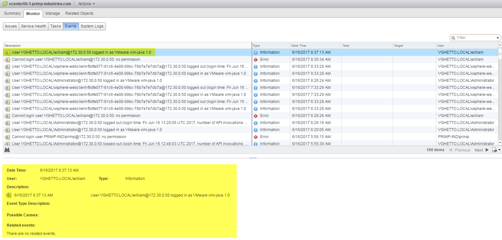
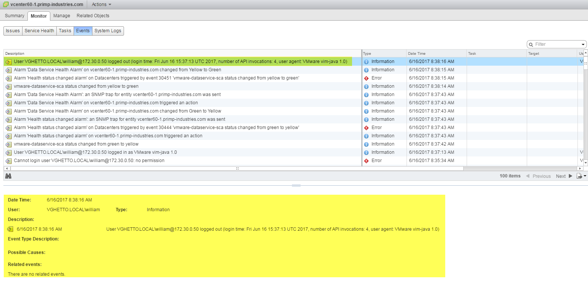

# Log examples of vCenter Server Authentication & Authorization activities

For more information and context, please refer to this blog post [here](http://www.virtuallyghetto.com/2017/06/auditinglogging-vcenter-server-authentication-authorization-activities.html).

## Table of Contents

* [vSphere 6.5](#vsphere-65)
  * Single Sign-On Activities
    * Successful SSO Login
    * Successful SSO Logout
    * Successful SSO Active Directory Login
    * Successful SSO Active Directory Logout
    * Failed SSO Login
    * Failed SSO Login (User not found)
    * Failed SSO Active Directory Login
    * Failed SSO Active Directory Login (User not found)
    * SSO User Creation
    * SSO User Password Change
    * SSO User Deletion
    * SSO Group Creation
    * SSO Group Assignment
    * SSO Group Deletion
  * vCenter Server Activities
    * Successful vCenter Server Login
    * Successful vCenter Server Logout
    * vSphere Permission Created
    * vSphere Permission Updated
    * vSphere Permission Deleted
    * vSphere Role Creation
    * vSphere Role Update
    * vSphere Role Deletion

* [vSphere 6.0 Update 3](#vsphere-60-update-3)
  * Single Sign-On Activities
    * Successful SSO Login
    * Successful SSO Logout
    * Successful SSO Active Directory Login
    * Successful SSO Active Directory Logout
    * Failed SSO Login
    * Failed SSO Login (User not found)
    * Failed SSO Active Directory Login
    * Failed SSO Active Directory Login (User not found)
    * SSO User Creation
    * SSO User Password Change
    * SSO User Deletion
    * SSO Group Creation
    * SSO Group Assignment
    * SSO Group Deletion
  * vCenter Server Activities
    * Successful vCenter Server Login
    * Successful vCenter Server Logout
    * vSphere Permission Created
    * vSphere Permission Updated
    * vSphere Permission Deleted
    * vSphere Role Creation
    * vSphere Role Update
    * vSphere Role Deletion
* [Additional Resources](#additional-resources)


## vSphere 6.5

### Single Sign-On Activities

* **Successful SSO Login**

Log Location: /var/log/vmware/sso/vmware-sts-idmd.log

```code
[2017-06-16T12:46:14.520Z vsphere.local d6cd47de-9bf1-4bf4-b53e-495b60366cbd INFO ] [IdentityManager] Authentication succeeded for user [administrator@vsphere.local] in tenant [vsphere.local] in [4] milliseconds with provider [vsphere.local] of type [com.vmware.identity.idm.server.provider.vmwdirectory.VMwareDirectoryProvider]
```

Log Location: /var/log/vmware/sso/ssoAdminServer.log

```code
[2017-06-16T12:51:48.931Z pool-9-thread-5 opId=f6912d25-8a52-4ff6-a42d-8b61faf1ccbd-89783-ngc INFO  com.vmware.identity.vlsi.SessionManagerImpl] User {Name: Administrator, Domain: VSPHERE.LOCAL} with role 'Administrator' logged in successfully.
```

* **Successful SSO Logout**

Log Location: /var/log/vmware/sso/ssoAdminServer.log

```code
[2017-06-16T12:49:55.733Z pool-9-thread-1 opId=f6912d25-8a52-4ff6-a42d-8b61faf1ccbd-89746-ngc INFO  com.vmware.identity.vlsi.SessionManagerImpl]  User {Name: Administrator, Domain: VSPHERE.LOCAL} with role 'Administrator' logged out.
[2017-06-16T12:49:55.733Z VLSI-session-reaper opId= DEBUG com.vmware.identity.vlsi.AuthorizationData] Session closed for User {Name: Administrator, Domain: VSPHERE.LOCAL} with role 'Administrator'.
```

* **Successful SSO Active Directory Login**

Log Location: /var/log/vmware/sso/vmware-sts-idmd.log

```code
[2017-06-16T12:58:55.638Z vsphere.local 963d4db2-e902-4c4c-b3e8-a32f198239fb INFO ] [IdentityManager] Authentication succeeded for user [primp@primp-industries.com] in tenant [vsphere.local] in [117] milliseconds with provider [primp-industries.com] of type [com.vmware.identity.idm.server.provider.activedirectory.ActiveDirectoryProvider]
```

* **Successful SSO Active Directory Logout**

Log Location: /var/log/vmware/sso/ssoAdminServer.log

```code
[2017-06-16T13:00:19.200Z pool-9-thread-5 opId=f6912d25-8a52-4ff6-a42d-8b61faf1ccbd-90410-ngc INFO  com.vmware.identity.vlsi.SessionManagerImpl]  User {Name: primp, Domain: PRIMP-INDUSTRIES.COM} with role 'GuestUser' logged out.
```

* **Failed SSO Login**

Log Location: /var/log/vmware/sso/vmware-sts-idmd.log

```code
[2017-06-16T13:02:53.268Z vsphere.local 296857de-90c4-407e-af0f-b30c0d7f3470 ERROR] [IdentityManager] Failed to authenticate principal [administrator@vsphere.local] for tenant [vsphere.local]
javax.security.auth.login.LoginException: Login failed
[2017-06-16T13:02:53.282Z vsphere.local 296857de-90c4-407e-af0f-b30c0d7f3470 INFO ] [VmEventAppender] EventLog: source=[VMware Identity Server], tenant=[vsphere.local], eventid=[USER_NAME_PWD_AUTH_FAILED], level=[ERROR], category=[VMEVENT_CATEGORY_IDM], text=[SimpleMessage[message=Failed to authenticate principal [administrator@vsphere.local]. Login failed]], detailText=[Login failed], corelationId=[296857de-90c4-407e-af0f-b30c0d7f3470], timestamp=[1497618173282]
```

* **Failed SSO Login (User not found)**

Log Location: /var/log/vmware/sso/vmware-sts-idmd.log

```code
[2017-06-16T13:11:04.533Z vsphere.local 9aff5155-e5f3-49b4-8b55-4d7c1789c23b ERROR] [IdentityManager] Failed to authenticate principal [william@vsphere.local] for tenant [vsphere.local]
javax.security.auth.login.LoginException: Login failed
```

* **Failed SSO Active Directory Login**

Log Location: /var/log/vmware/sso/vmware-sts-idmd.log

```code
[2017-06-16T13:06:35.039Z vsphere.local 0697b604-7509-418f-aec7-890884b4a0c6 ERROR] [IdentityManager] Failed to authenticate principal [primp@primp-industries.com] for tenant [vsphere.local]
com.vmware.identity.interop.idm.IdmNativeException: Native platform error [code: -1765328360][null][null]
[2017-06-16T13:06:35.041Z vsphere.local 0697b604-7509-418f-aec7-890884b4a0c6 INFO ] [VmEventAppender] EventLog: source=[VMware Identity Server], tenant=[vsphere.local], eventid=[USER_NAME_PWD_AUTH_FAILED], level=[ERROR], category=[VMEVENT_CATEGORY_IDM], text=[SimpleMessage[message=Failed to authenticate principal [primp@primp-industries.com]. Native platform error [code: -1765328360][null][null]]], detailText=[Native platform error [code: -1765328360][null][null]], corelationId=[0697b604-7509-418f-aec7-890884b4a0c6], timestamp=[1497618395041]
```

* **Failed SSO Active Directory Login (User not found)**

Log Location: /var/log/vmware/sso/vmware-sts-idmd.log

```code
[2017-06-16T13:16:08.098Z vsphere.local 0c82a1ca-747d-4b4b-8370-4dc3265f6382 INFO ] [ActiveDirectoryProvider] Failed to retrieve default UPN for principal vghetto@primp-industries.com
com.vmware.identity.idm.InvalidPrincipalException: Principal id vghetto@primp-industries.com does not exist
```

* **SSO User Creation**

Log Location: /var/log/vmware/sso/ssoAdminServer.log

```code
[2017-06-16T13:27:42.542Z pool-9-thread-5 opId=SsoNewUserViewMediator-add-90607-ngc INFO  com.vmware.identity.admin.vlsi.PrincipalManagementServiceImpl] [User {Name: Administrator, Domain: VSPHERE.LOCAL} with role 'Administrator'] Creating local person user 'william' with details {'For Mr. vGhetto','wlam@virtuallyghetto.com','William','Lam','null'}
```

* **SSO User Password Change**

Log Location: /var/log/vmware/sso/vmware-sts-idmd.log

```code
[2017-06-16T13:36:09.880Z pool-9-thread-2 opId=SsoChangePasswordViewMediator-apply-91193-ngc INFO  com.vmware.identity.admin.vlsi.PrincipalManagementServiceImpl] [User {Name: william, Domain: vsphere.local} with role 'GuestUser'] Resetting password of local user 'william'.
```

* **SSO User Deletion**

Log Location: /var/log/vmware/sso/ssoAdminServer.log

```code
[2017-06-16T22:15:19.929Z pool-9-thread-2 opId=UsersActionCommand-remove-109576-ngc INFO  com.vmware.identity.admin.vlsi.PrincipalManagementServiceImpl] [User {Name: Administrator, Domain: VSPHERE.LOCAL} with role 'Administrator'] Deleting principal 'william'
```

* **SSO Group Creation**

Log Location: /var/log/vmware/sso/vmware-sts-idmd.log

```code
[2017-06-16T22:20:16.996Z pool-9-thread-1 opId=SsoNewGroupViewMediator-add-109931-ngc INFO  com.vmware.identity.admin.vlsi.PrincipalManagementServiceImpl] [User {Name: Administrator, Domain: VSPHERE.LOCAL} with role 'Administrator'] Creating local group 'vGhetoSSOGroup' with details {''}
```

* **SSO Group Assignment**

Log Location: /var/log/vmware/sso/vmware-sts-idmd.log

```code
[2017-06-16T22:24:21.817Z pool-9-thread-4 opId=SsoAddGroupPrincipalsViewMediator-apply-110228-ngc INFO  com.vmware.identity.admin.vlsi.PrincipalManagementServiceImpl] [User {Name: Administrator, Domain: VSPHERE.LOCAL} with role 'Administrator'] Adding users to local group 'vGhetoSSOGroup'
```

* **SSO Group Deletion**

Log Location: /var/log/vmware/sso/vmware-sts-idmd.log

```code
[2017-06-16T22:23:26.941Z pool-9-thread-4 opId=GroupsActionCommand-apply-110158-ngc INFO  com.vmware.identity.admin.vlsi.PrincipalManagementServiceImpl] [User {Name: Administrator, Domain: VSPHERE.LOCAL} with role 'Administrator'] Removing principals from local group 'vGhetoSSOGroup'
```

### vCenter Server Activitites

* **Successful vCenter Server Login**

Log Location: /var/log/vmware/vpx/vpxd.log (must enable remote syslog, see [here](http://www.virtuallyghetto.com/2017/02/what-logs-do-i-get-when-i-enable-syslog-in-vcsa-6-5.html) for details)



* **Successful vCenter Server Logout**

Log Location: /var/log/vmware/vpx/vpxd.log (must enable remote syslog, see [here](http://www.virtuallyghetto.com/2017/02/what-logs-do-i-get-when-i-enable-syslog-in-vcsa-6-5.html) for details)



* **vSphere Permission Created**

Log Location: /var/log/vmware/vpxd-svcs/vpxd-svcs.log

```code
2017-06-16T16:31:13.400Z [tomcat-exec-43  INFO  AuthorizationService.AuditLog  opId=571a0705-11ca-4fa6-ad5e-a4915b91cbaf] Action performed by principal(name=VSPHERE.LOCAL\Administrator,isGroup=false):Added access control [ Principal=Name=VSPHERE.LOCAL\william,isGroup=false,roles=[-1],propogating=true ] to document urn:vmomi:Folder:group-d1:d245fd02-fdd7-4632-ac80-84de521a9140
```

* **vSphere Permission Updated**

Log Location: /var/log/vmware/vpxd-svcs/vpxd-svcs.log

```code
2017-06-16T16:31:34.653Z [tomcat-exec-65  INFO  AuthorizationService.AuditLog  opId=] Action performed by principal(name=VSPHERE.LOCAL\Administrator,isGroup=false):Added access control [ Principal=Name=VSPHERE.LOCAL\william,isGroup=false,roles=[-2],propogating=true ] to document urn:vmomi:Folder:group-d1:d245fd02-fdd7-4632-ac80-84de521a9140
```

* **vSphere Permission Deleted**

Log Location: /var/log/vmware/vpxd-svcs/vpxd-svcs.log

```code
2017-06-16T16:31:58.982Z [tomcat-exec-69  INFO  AuthorizationService.AuditLog  opId=] Action performed by principal(name=VSPHERE.LOCAL\Administrator,isGroup=false):Remove access control for principals [ Name=VSPHERE.LOCAL\william,isGroup=false ] on document urn:vmomi:Folder:group-d1:d245fd02-fdd7-4632-ac80-84de521a9140
```

* **vSphere Role Creation**

Log Location: /var/log/vmware/vpxd-svcs/vpxd-svcs.log

```code
2017-06-16T16:32:24.851Z [tomcat-exec-96  INFO  AuthorizationService.AuditLog  opId=fa50ba35-1839-4557-aa07-a6c81a1edb5e] Action performed by principal(name=VSPHERE.LOCAL\Administrator,isGroup=false):Add role Id=295755225,Name=YouShouldNotBeAllowedToLogin,Description=,Tenant=Privileges=[System.Anonymous, System.Read, System.View]
```

* **vSphere Role Update**

Log Location: /var/log/vmware/vpxd-svcs/vpxd-svcs.log

```code
2017-06-16T16:32:46.947Z [tomcat-exec-129  INFO  AuthorizationService.AuditLog  opId=] Action performed by principal(name=VSPHERE.LOCAL\Administrator,isGroup=false):Update role Id=295755225,Name=YouShouldNotBeAllowedToLogin,Description=,Tenant=Privileges=[System.Anonymous, System.Read, System.View, Alarm.Acknowledge, Alarm.Create, Alarm.DisableActions, Alarm.Edit, Alarm.Delete, Alarm.SetStatus]
```

* **vSphere Role Deletion**

Log Location: /var/log/vmware/vpxd-svcs/vpxd-svcs.log

```code
2017-06-16T16:33:02.929Z [tomcat-exec-153  INFO  AuthorizationService.AuditLog  opId=] Action performed by principal(name=VSPHERE.LOCAL\Administrator,isGroup=false):Delete role 295755225
```

## vSphere 6.0 Update 3

### Single Sign-On Activities

* **Successful SSO Login**

Log Location: /var/log/vmware/sso/vmware-sts-idmd.log

```code
[2017-06-16T12:45:16.392Z vghetto.local f31156bd-f84f-4728-aaa1-556045c9c6bc INFO ] [IdentityManager] Authentication succeeded for user [administrator@vghetto.local] in tenant [vghetto.local] in [6] milliseconds with provider [vghetto.local] of type [com.vmware.identity.idm.server.provider.vmwdirectory.VMwareDirectoryProvider]
```

* **Successful SSO Logout**

Log Location: /var/log/vmware/sso/ssoAdminServer.log

```code
[2017-06-16T12:48:17.539Z pool-9-thread-1 opId=f6912d25-8a52-4ff6-a42d-8b61faf1ccbd-89518-ngc INFO  com.vmware.identity.vlsi.SessionManagerImpl] User {Name: Administrator, Domain: VSPHERE.LOCAL} with role 'Administrator' logged in successfully.
```

* **Successful SSO Active Directory Login**

Log Location: /var/log/vmware/sso/ssoAdminServer.log

```code
[2017-06-16T12:55:39.611Z pool-3-thread-1 opId=51b5470c-d116-438e-a3cc-6975f4c4c6f9 INFO  com.vmware.identity.vlsi.SessionManagerImpl] User {Name: Administrator, Domain: VGHETTO.LOCAL} with role 'Administrator' logged out.
```

* **Successful SSO Active Directory Logout**

Log Location: /var/log/vmware/sso/ssoAdminServer.log

```code
[2017-06-16T12:58:14.195Z vghetto.local 55e0df54-27da-4e5a-b6bd-23c7433f119d INFO ] [IdentityManager] Authentication succeeded for user [primp@primp-industries.com] in tenant [vghetto.local] in [192] milliseconds with provider [primp-industries.com] of type [com.vmware.identity.idm.server.provider.activedirectory.ActiveDirectoryProvider
```

* **Failed SSO Login**

Log Location: /var/log/vmware/sso/vmware-sts-idmd.log

```code
[2017-06-16T13:02:25.875Z vghetto.local b5da6cc1-a44f-446b-93f3-49cfd41c8437 ERROR] [IdentityManager] Failed to authenticate principal [administrator@vghetto.local] for tenant [vghetto.local]
javax.security.auth.login.LoginException: Login failed
```

* **Failed SSO Login (User not found)**

Log Location: /var/log/vmware/sso/vmware-sts-idmd.log

```code
[2017-06-16T13:09:44.985Z vghetto.local 440666fd-b866-440a-90b9-38479d870715 INFO ] [ActiveDirectoryProvider] Failed to retrieve default UPN for principal william@vsphere.local
com.vmware.identity.idm.InvalidPrincipalException: Principal id william@vsphere.local does not exist
```

* **Failed SSO Active Directory Login**

Log Location: /var/log/vmware/sso/vmware-sts-idmd.log

```code
[2017-06-16T13:05:26.676Z vghetto.local 73a21ff6-547b-4f26-94e4-2c08588d27d8 ERROR] [IdentityManager] Failed to authenticate principal [primp@primp-industries.com] for tenant [vghetto.local]
com.vmware.identity.interop.idm.IdmNativeException: Native platform error [code: -1765328360][null][null]
```

```code
[2017-06-16T13:05:26.679Z vghetto.local 73a21ff6-547b-4f26-94e4-2c08588d27d8 INFO ] [VmEventAppender] EventLog: source=[VMware Identity Server], tenant=[vghetto.local], eventid=[USER_NAME_PWD_AUTH_FAILED], level=[ERROR], category=[VMEVENT_CATEGORY_IDM], text=[Failed to authenticate principal [primp@primp-industries.com]. Native platform error [code: -1765328360][null][null]], detailText=[com.vmware.identity.interop.idm.IdmNativeException: Native platform error [code: -1765328360][null][null]
```

* **Failed SSO Active Directory Login (User not found)**

Log Location: /var/log/vmware/sso/vmware-sts-idmd.log

```code
[2017-06-16T13:15:38.622Z vghetto.local dc12010a-1d65-4ae1-8521-a50077a1d6d2 INFO ] [ActiveDirectoryProvider] Failed to retrieve default UPN for principal vghetto@primp-industries.com
com.vmware.identity.idm.InvalidPrincipalException: Principal id vghetto@primp-industries.com does not exist
```

* **SSO User Creation**

Log Location: /var/log/vmware/sso/ssoAdminServer.log

```code
[2017-06-16T13:25:39.718Z pool-3-thread-1 opId=bc67fcc4-4170-4a16-a02c-560476adf2f8 INFO  com.vmware.identity.admin.vlsi.PrincipalManagementServiceImpl] [User {Name: Administrator, Domain: VGHETTO.LOCAL} with role 'Administrator'] Creating local person user 'william' with details {'For Mr. vGhetto','wlam@virtuallyghetto.com','William','Lam','null'}
```

* **SSO User Password Change**

Log Location: /var/log/vmware/sso/vmware-sts-idmd.log

```code
[2017-06-16T13:31:01.309Z pool-3-thread-3 opId=845e0011-386e-471f-9787-d2c75a2a6f5f INFO  com.vmware.identity.admin.vlsi.PrincipalManagementServiceImpl] [User {Name: william, Domain: vghetto.local} with role 'GuestUser'] Resetting password of local user 'william'.
```

* **SSO User Deletion**

Log Location: /var/log/vmware/sso/ssoAdminServer.log

```code
[2017-06-16T22:15:19.929Z pool-9-thread-2 opId=UsersActionCommand-remove-109576-ngc INFO  com.vmware.identity.admin.vlsi.PrincipalManagementServiceImpl] [User {Name: Administrator, Domain: VSPHERE.LOCAL} with role 'Administrator'] Deleting principal 'william'
```

* **SSO Group Creation**

Log Location: /var/log/vmware/sso/vmware-sts-idmd.log

```code
[2017-06-16T15:28:58.067Z pool-3-thread-2 opId=3f6da356-7369-461a-ab34-060a1f4edc8d INFO  com.vmware.identity.admin.vlsi.PrincipalManagementServiceImpl] [User {Name: Administrator, Domain: VGHETTO.LOCAL} with role 'Administrator'] Creating local group 'vGhetto-Group' with details {''}
```

* **SSO Group Assignment**

Log Location: /var/log/vmware/sso/vmware-sts-idmd.log

```code
[2017-06-16T15:30:04.731Z pool-3-thread-1 opId=2296cc54-5a08-4b50-b554-4872aa5e2b0d INFO  com.vmware.identity.admin.vlsi.PrincipalManagementServiceImpl] [User {Name: Administrator, Domain: VGHETTO.LOCAL} with role 'Administrator'] Adding users to local group 'vGhetto-Group'
```

* **SSO Group Deletion**

Log Location: /var/log/vmware/sso/vmware-sts-idmd.log

```code
[2017-06-16T15:31:24.999Z pool-3-thread-1 opId=7b4bf623-9b06-41c1-9661-e16f90e1fe2d INFO  com.vmware.identity.admin.vlsi.PrincipalManagementServiceImpl] [User {Name: Administrator, Domain: VGHETTO.LOCAL} with role 'Administrator'] Deleting principal 'vGhetto-Group'
```

### vCenter Server Activitites

* **Successful vCenter Server Login**

Log Location: /var/log/vmware/vpx/vpxd.log (must enable remote syslog, see [here](http://www.virtuallyghetto.com/2017/02/what-logs-do-i-get-when-i-enable-syslog-in-vcsa-6-5.html) for details)


* **Successful vCenter Server Logout**

Log Location: /var/log/vmware/vpx/vpxd.log (must enable remote syslog, see [here](http://www.virtuallyghetto.com/2017/02/what-logs-do-i-get-when-i-enable-syslog-in-vcsa-6-5.html) for details)


* **vSphere Permission Created**

Log Location: /var/log/vmware/vpxd-svcs/vpxd-svcs.log

```code
2017-06-16T16:23:19.148Z [tomcat-exec-291  INFO  AuthorizationService.AuditLog  opId=] Action performed by principal(name=VGHETTO.LOCAL\Administrator,isGroup=false):Added access control [ Principal=Name=VGHETTO.LOCAL\william,isGroup=false,roles=[-1],propogating=true ] to document urn:vmomi:Folder:group-d1:cd607b82-913a-4d82-9c00-875829f5afb7
```

* **vSphere Permission Updated**

Log Location: /var/log/vmware/vpxd-svcs/vpxd-svcs.log

```code
2017-06-16T16:23:37.988Z [tomcat-exec-75  INFO  AuthorizationService.AuditLog  opId=] Action performed by principal(name=VGHETTO.LOCAL\Administrator,isGroup=false):Added access control [ Principal=Name=VGHETTO.LOCAL\william,isGroup=false,roles=[-2],propogating=true ] to document urn:vmomi:Folder:group-d1:cd607b82-913a-4d82-9c00-875829f5afb7
```

* **vSphere Permission Deleted**

Log Location: /var/log/vmware/vpxd-svcs/vpxd-svcs.log

```code
2017-06-16T16:23:59.911Z [tomcat-exec-108  INFO  AuthorizationService.AuditLog  opId=] Action performed by principal(name=VGHETTO.LOCAL\Administrator,isGroup=false):Remove access control for principals [ Name=VGHETTO.LOCAL\william,isGroup=false ] on document urn:vmomi:Folder:group-d1:cd607b82-913a-4d82-9c00-875829f5afb7
```

* **vSphere Role Creation**

Log Location: /var/log/vmware/vpxd-svcs/vpxd-svcs.log

```code
2017-06-16T16:25:21.154Z [tomcat-exec-282  INFO  AuthorizationService.AuditLog  opId=] Action performed by principal(name=VGHETTO.LOCAL\Administrator,isGroup=false):Add role Id=429606320,Name=YouShouldNotBeAllowedToLoginRole,Description=,Tenant=Privileges=[System.Read, System.View, System.Anonymous]
```

* **vSphere Role Update**

Log Location: /var/log/vmware/vpxd-svcs/vpxd-svcs.log

```code
2017-06-16T16:25:47.999Z [tomcat-exec-16  INFO  AuthorizationService.AuditLog  opId=] Action performed by principal(name=VGHETTO.LOCAL\Administrator,isGroup=false):Update role Id=429606320,Name=YouShouldNotBeAllowedToLoginRole,Description=,Tenant=Privileges=[System.Read, System.View, System.Anonymous, Alarm.Acknowledge, Alarm.Create, Alarm.DisableActions, Alarm.Edit, Alarm.Delete, Alarm.SetStatus]
```

* **vSphere Role Deletion**

Log Location: /var/log/vmware/vpxd-svcs/vpxd-svcs.log

```code
2017-06-16T16:26:07.531Z [tomcat-exec-298  INFO  AuthorizationService.AuditLog  opId=] Action performed by principal(name=VGHETTO.LOCAL\Administrator,isGroup=false):Delete role 429606320
```

## Aditional Resources

* [What logs do I get when I enable syslog in VCSA 6.5?](http://www.virtuallyghetto.com/2017/02/what-logs-do-i-get-when-i-enable-syslog-in-vcsa-6-5.html)
* [How to forward additional logs using vCenter Server Appliance 6.5](http://www.virtuallyghetto.com/2017/02/how-to-forward-other-vcsa-6-5-logs-to-remote-syslog-server.html)
* [A preview of native syslog support in VCSA 6.0](http://www.virtuallyghetto.com/2015/03/a-preview-of-native-syslog-support-in-vcsa-6-0.html)
* [How to forward additional logs using vCenter Server Appliance 6.0](http://www.virtuallyghetto.com/2012/08/forwarding-vcenter-server-logs-to.html)
